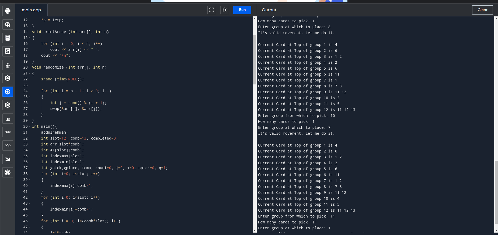

# Spider Solitaire



## About

Spider Solitaire is a classic card game that has been enjoyed by players for many years. This project is an implementation of Spider Solitaire in [C++], offering a fun and challenging gaming experience for users.

## Features

- A backend code has been written in C++ which can be used as base algorithm in game development


## Installation

To clone and run Spider Solitaire locally, follow these steps:

1. Clone the repository to your local machine using the following command:

   ```bash
   git clone https://github.com/kashif2000/spider-solitair.git
  
2. Compile and run back-end.cpp.
